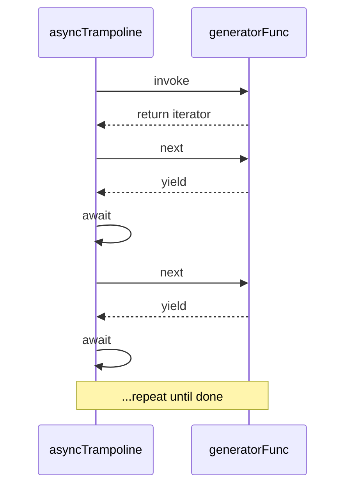

## Trampoline in action

```mermaid
sequenceDiagram
 participant t as asyncTrampoline
 participant g as generatorFunc
  t->>g: invoke
  g-->>t: return iterator
  t->>g: next
  g-->>t: yield
  t->>t: await
  t->>g: next
  g-->>t: yield
  t->>t: await
  Note over t,g: ...repeat until done
```